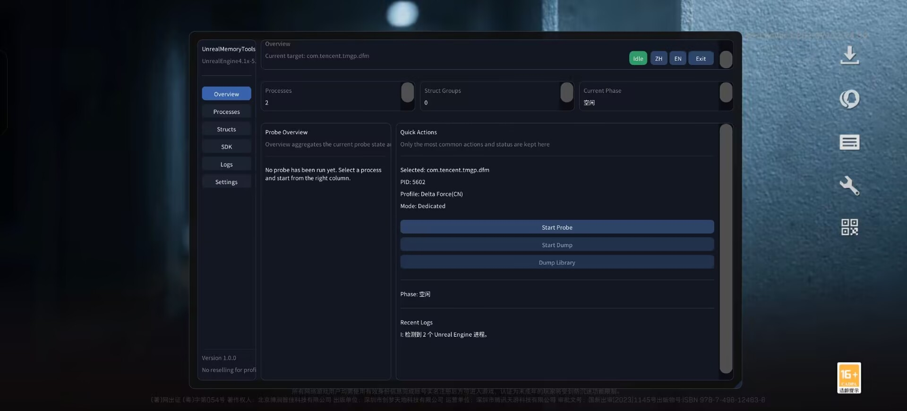
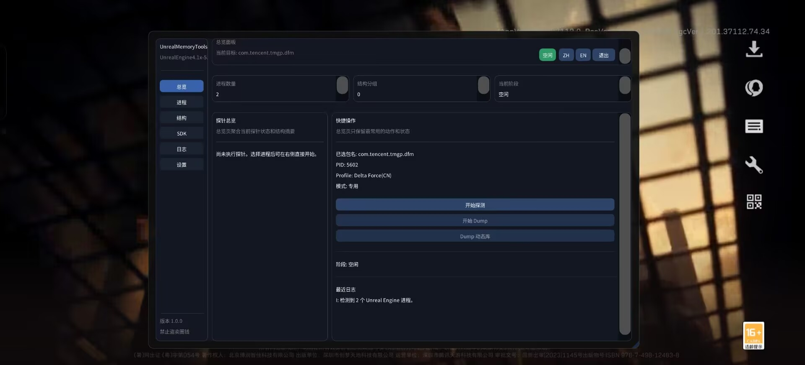

# UnrealMemoryTools

Android Unreal Engine Dumper with a Vulkan / ImGui overlay UI, dedicated game profiles, and a generic `AutoFix` pipeline.

> Author: 曦曦 (DreamFekk) — https://github.com/DreamFekk
> No reselling for profit / 禁止圈钱盗卖
> QQ Group(群) 977186929

[English](#english) | [中文](#中文)

---

## English

### Overview

`UnrealMemoryTools` is an external (out-of-process) Unreal Engine dumper for Android. It runs as a regular ELF binary and reads the target game memory through `KittyMemoryEx`. The previous CLI workflow has been replaced with a Vulkan + ImGui overlay UI inspired by `AndUEProber`, and the dump pipeline has been split into two explicit steps: **Probe** then **Dump**.

The program ships with both:

- **Dedicated profiles** — hardcoded offsets for known games
- **AutoFix** — a generic UE4 / UE5 fallback that brute-force locates `GNames`, `FNamePool`, `GUObjectArray`, etc., and patches struct offsets at runtime

If a dedicated profile fails to initialize on a newer game build, UnrealMemoryTools automatically falls back to AutoFix and clearly tells you so in the UI.

### Preview



### Features

- ImGui overlay UI (Vulkan, FreeType, Chinese / English switch at runtime)
- Two-step pipeline: **Probe** (validate offsets) then **Dump** (write SDK)
- Per-process state isolation — switching processes always re-resolves the UE ELF and `UEVars`
- Dedicated profiles + AutoFix fallback (with visible "fell back to auto" hint)
- Per-tab structure inspector: UObject / UField / UStruct / UClass / UFunction / FField+FProperty / FName / FUObjectArray / UEnum
  Each tab lists `Field / Type / Offset / Status / Notes`, color-coded green = identified, red = unknown
- One-click **Dump Library** button — dumps `libUE4.so` / `libUnreal.so` from process memory via `/proc/<pid>/mem`
- SDK output split per category, plus a Dumper-7 style `SDK_Offset.hpp` member-offset header

### Output files

Default output root: `/sdcard/UnrealMemoryTools/<package>/`

| File | Purpose |
|---|---|
| `Logs.txt` | Full run log |
| `Objects.txt` | Object index / address / full name dump |
| `Offsets.hpp` | Key engine pointers (`GNames`, `GUObjectArray`, `GWorld`, `Matrix`, `ProcessEvent`, ...) relative to UE base |
| `AIOHeader.hpp` | Aggregator that includes `SDK_Enums.hpp` / `SDK_Structs.hpp` / `SDK_Classes.hpp` |
| `SDK_Enums.hpp` | All enums |
| `SDK_Structs.hpp` | All structs |
| `SDK_Classes.hpp` | All classes (with vtable comments: `VTableIndex` / slot offset / function RVA) |
| `SDK_Offset.hpp` | Dumper-7 style member offsets — see below |
| `script.json` | Function script for IDA / Ghidra automation |
| `libUE4.so` / `libUnreal.so` | (Optional) memory dump of the runtime UE library |

#### `SDK_Offset.hpp` layout

```cpp
#pragma once
#include <cstdint>

namespace SDKOffset
{

// Class CoreUObject.Object  Size: 0x28 (Inherited: 0x0)
namespace UObject
{
    constexpr ::std::uintptr_t __Size      = 0x28;
    constexpr ::std::uintptr_t __Inherited = 0x0;

    constexpr ::std::uintptr_t ObjectFlags   = 0x8;  // EObjectFlags
    constexpr ::std::uintptr_t InternalIndex = 0xC;  // int32_t
    // ...

    namespace Functions
    {
        constexpr ::std::uintptr_t ExecuteUbergraph = 0x12345; // RVA from UE base
    }
}

}
```

Usage:

```cpp
auto flags = ReadAt<uint32_t>(uobj + SDKOffset::UObject::ObjectFlags);
uintptr_t func = libUE_base + SDKOffset::UObject::Functions::ExecuteUbergraph;
```

### UI workflow

1. Process list (left pane) lists every running process that has `libUE4.so` / `libUnreal.so` loaded, plus everything matched by a dedicated profile.
2. Pick a process, click **Start Probe**. The probe initializes `KittyMemoryMgr`, locates `GNames` / `GUObjectArray`, runs `AutoFix`, and fills the tabs.
3. Inspect tabs — anything red means AutoFix could not resolve that field. The probe still succeeds as long as the core pointers are valid.
4. Click **Start Dump** to write the SDK and all `*.hpp` files.
5. Click **Dump Library** to additionally save the in-memory `libUE4.so` / `libUnreal.so`.
6. Switch language any time with the **中文 / English** small buttons in the title bar.

### Mode column: Dedicated vs Auto

The process list shows **Dedicated** (matched by hardcoded offsets) or **Auto** (matched only by having `libUE*.so` loaded). The actual probe may still fall back from Dedicated to Auto if the dedicated profile's offsets are stale for the current game build. When that happens you will see:

```
W: 专用 Profile 初始化失败 (...)，回退到自动 Profile。
I: 使用自动 Profile (UE4/UE5 通用) 进行探测。
```

…and the **Mode** label in the summary tab will switch to `Auto`.

### Built-in dedicated profiles

`暗区突围`, `三角洲行动`, `远光 84`, `枪战特训 2`, `无畏契约`, `洛克王国: 世界`, `和平精英`.

### Build

Toolchain:

- Android NDK r25 or newer
- CMake + Ninja
- clang with C++20

```bash
cd UnrealMemoryTools
cmake -S . -B build -G Ninja -DCMAKE_BUILD_TYPE=Release
cmake --build build -j4
```

The output binary lands in `UnrealMemoryTools/outputs/arm64-v8a/`.

> Tip: building under a Chinese-character path may trigger `GetOverlappedResult` errors with Ninja on Windows. Prefer building inside CLion or use an ASCII path.

### Run

```bash
adb push UnrealMemoryTools /data/local/tmp/
adb shell "su -c 'chmod 777 /data/local/tmp/UnrealMemoryTools && /data/local/tmp/UnrealMemoryTools'"
```

A Vulkan overlay window will appear on the device. Root or equivalent access is required to read other processes' memory.

### License / use

For learning, reverse-engineering practice, and personal research only. **Do not** repackage or sell. **Do not** use the dumped SDK to build paid hacks.

### Credits

- [AndUEDumper](https://github.com/MJx0/AndUEDumper)
- [Dumper-7](https://github.com/Encryqed/Dumper-7)
- [UEDumper](https://github.com/Spuckwaffel/UEDumper)
- [UE4Dumper-4.25](https://github.com/guttir14/UnrealDumper-4.25)
- KittyMemoryEx
- ImGui / FreeType / Vulkan

---

## 中文

### 简介

`UnrealMemoryTools` 是一个面向 Android Unreal Engine 游戏的**外部** Dumper（不注入、不 hook，纯 `/proc/<pid>/mem` 读内存）。基于 `AndUEDumper` 改造而来，并融合了 `Dumper-7` 风格的 SDK 输出与 `AndUEProber` 风格的两步交互。

旧版命令行交互已经全部移除，改成 **Vulkan + ImGui 悬浮 UI**，流程拆成两步：**探针 → Dump**。

工具同时具备：

- **专用 Profile**：内置游戏的硬编码偏移
- **AutoFix（通用兜底）**：UE4 / UE5 通用，通过特征码暴搜 `GNames`、`FNamePool`、`GUObjectArray`，并在运行时修补结构偏移

专用 Profile 在新版游戏上失效时会**自动回退到 AutoFix**，并在 UI 上明确标出"已回退"。

### 界面预览



### 特性

- ImGui 悬浮窗 UI（Vulkan + FreeType，运行时随时切换 中文 / English）
- 两步流程：**开始探测**（校验偏移） → **开始 Dump**（写 SDK）
- 跨进程状态隔离：每次切换进程都会重新定位 UE ELF 和 `UEVars`，不会读到上次残留
- 专用 Profile + AutoFix 兜底，带"已回退到自动"提示
- 结构体逐标签查看：UObject / UField / UStruct / UClass / UFunction / FField+FProperty / FName / FUObjectArray / UEnum
  每个标签 5 列：`字段 / 类型 / 偏移 / 状态 / 说明`，绿色"已识别"红色"未识别"
- 一键 **Dump 动态库**：直接通过 `/proc/<pid>/mem` 转储 `libUE4.so` / `libUnreal.so`
- SDK 按类型拆文件，附 Dumper-7 风格的 `SDK_Offset.hpp` 成员偏移头

### 输出文件

默认输出根目录：`/sdcard/UnrealMemoryTools/<package>/`

| 文件 | 说明 |
|---|---|
| `Logs.txt` | 完整运行日志 |
| `Objects.txt` | 对象索引 / 地址 / 全名 列表 |
| `Offsets.hpp` | 关键引擎指针（`GNames`、`GUObjectArray`、`GWorld`、`Matrix`、`ProcessEvent` 等），相对 UE 基址 |
| `AIOHeader.hpp` | 总聚合头，include 下面三个 SDK 头 |
| `SDK_Enums.hpp` | 所有枚举 |
| `SDK_Structs.hpp` | 所有结构体 |
| `SDK_Classes.hpp` | 所有类（虚表注释含 `VTableIndex` / 槽位偏移 / 函数 RVA） |
| `SDK_Offset.hpp` | Dumper-7 风格的成员偏移头，见下文 |
| `script.json` | 给 IDA / Ghidra 自动化用的函数脚本 |
| `libUE4.so` / `libUnreal.so` | （可选）从进程内存转储的 UE 动态库 |

#### `SDK_Offset.hpp` 形态

```cpp
#pragma once
#include <cstdint>

namespace SDKOffset
{

// Class CoreUObject.Object  Size: 0x28 (Inherited: 0x0)
namespace UObject
{
    constexpr ::std::uintptr_t __Size      = 0x28;
    constexpr ::std::uintptr_t __Inherited = 0x0;

    constexpr ::std::uintptr_t ObjectFlags   = 0x8;  // EObjectFlags
    constexpr ::std::uintptr_t InternalIndex = 0xC;  // int32_t
    // ...

    namespace Functions
    {
        constexpr ::std::uintptr_t ExecuteUbergraph = 0x12345; // 相对 UE 基址
    }
}

}
```

使用：

```cpp
auto flags = ReadAt<uint32_t>(uobj + SDKOffset::UObject::ObjectFlags);
uintptr_t func = libUE_base + SDKOffset::UObject::Functions::ExecuteUbergraph;
```

### UI 流程

1. 左侧"进程列表"会列出所有加载了 `libUE4.so` / `libUnreal.so` 的进程，外加命中专用 Profile 的进程
2. 选中一个进程，点 **开始探测**：会初始化 `KittyMemoryMgr`、定位 `GNames` / `GUObjectArray`、跑 AutoFix，结果填到右侧标签页
3. 看标签页：红色 = AutoFix 未识别该字段。只要核心指针都有效，探针就算成功
4. 点 **开始 Dump**：写出 SDK 和所有 `*.hpp`
5. 点 **Dump 动态库**：追加保存内存中的 `libUE4.so` / `libUnreal.so`
6. 顶栏 **中文 / English** 小按钮可随时切换语言

### 模式列：专用 vs 自动

进程列表里的"专用 / 自动"只代表"包名是不是命中了内置 Profile"，并不代表实际跑哪条管线。如果命中了专用 Profile 但偏移已经过期，会自动回退到 AutoFix，此时日志会出现：

```
W: 专用 Profile 初始化失败 (...)，回退到自动 Profile。
I: 使用自动 Profile (UE4/UE5 通用) 进行探测。
```

并且摘要标签页里"模式"会变成 `自动`。

### 已适配的专用 Profile

暗区突围 / 三角洲行动 / 远光 84 / 枪战特训 2 / 无畏契约 / 洛克王国: 世界 / 和平精英

### 构建

工具链要求：

- Android NDK r25 或更新
- CMake + Ninja
- 支持 C++20 的 clang

```bash
cd UnrealMemoryTools
cmake -S . -B build -G Ninja -DCMAKE_BUILD_TYPE=Release
cmake --build build -j4
```

产物在 `UnrealMemoryTools/outputs/arm64-v8a/`。

> 注意：Windows 上 Ninja 在中文路径下会偶发 `GetOverlappedResult` 报错。建议在 CLion 内构建，或换成纯英文路径。

### 运行

```bash
adb push UnrealMemoryTools /data/local/tmp/
adb shell "su -c 'chmod 777 /data/local/tmp/UnrealMemoryTools && /data/local/tmp/UnrealMemoryTools'"
```

设备上会出现 Vulkan 悬浮窗。读取其它进程内存需要 root 或等价权限。

### 使用许可

仅用于学习、逆向研究和个人技术练习。**禁止**重新打包售卖、**禁止**用 Dump 出来的 SDK 制作付费外挂、**禁止**圈钱盗卖。

### 致谢

- [AndUEDumper](https://github.com/MJx0/AndUEDumper)
- [Dumper-7](https://github.com/Encryqed/Dumper-7)
- [UEDumper](https://github.com/Spuckwaffel/UEDumper)
- [UE4Dumper-4.25](https://github.com/guttir14/UnrealDumper-4.25)
- KittyMemoryEx
- ImGui / FreeType / Vulkan
